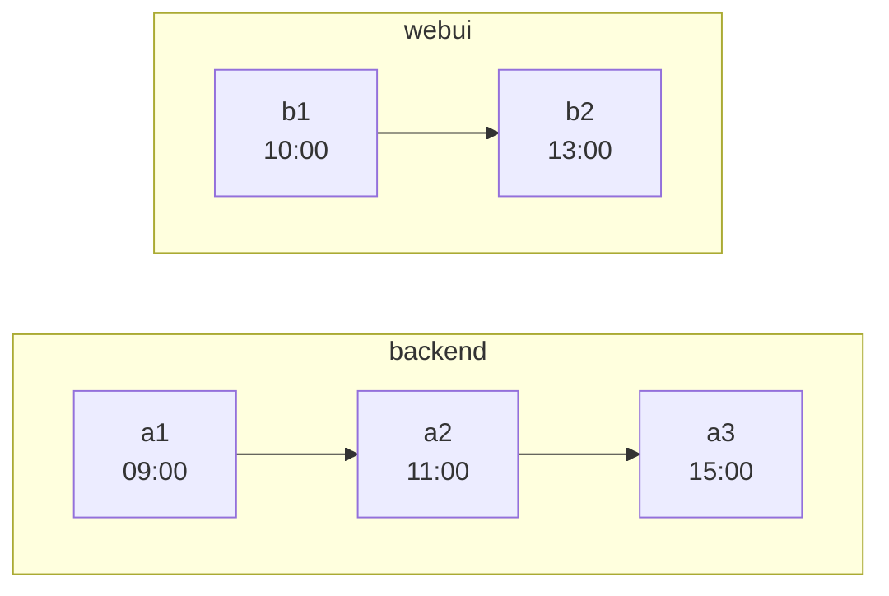
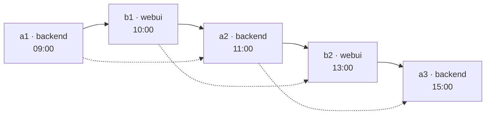

# git-timebraid

*A tool for merging several git repositories into one.*

[Quick start](#quick-start) · [Install](doc/install.md) · [Usage](doc/usage.md) ·
[How it works](doc/how-it-works.md) · [Examples](doc/examples/README.md)

Every other way of doing this ties the knot once and walks away.\
This one keeps braiding — every input's commits crossed into a single timeline, oldest to newest,
all the way down.

So the output has one mainline, and it is every repository's commits *interleaved* by date — not one
history stacked after another.

Check out any commit on it and every repository holds whatever it had last committed — the whole
system, frozen at that instant.

---

## How it looks

Two repositories, one afternoon of work:



Braided:



- Solid arrows: the braided edges the tool adds.
- Dotted arrows: the original edges, all of them still there.
- Arrows point from parent to child, so time flows left to right.

Checking out `b2` gives you `backend/` as of `a2` and `webui/` as of `b2` — the state of the world
at 13:00.

---

## Quick start

Download the archive for your platform from
[Releases](https://github.com/loplex/git-timebraid/releases), unpack it, and put its `bin/` on
`PATH`. It carries its own JVM, so there is nothing else to install:

```bash
mkdir -p ~/opt
tar xzf git-timebraid-<version>-linux-x64.tar.gz -C ~/opt
export PATH="$HOME/opt/git-timebraid-<version>-linux-x64/bin:$PATH"
```

Then point it at the repositories you want braided:

```bash
git-timebraid -o /tmp/merged ~/repos/backend.git ~/repos/webui.git ~/repos/codegen.git
```

That makes `/tmp/merged` a bare repository whose mainline braids every input's mainline in date
order, each input's files under its own `backend/`, `webui/` or `codegen/`. The inputs' other
branches and their tags come along too, each prefixed with its input's name: `webui/feature`,
`webui/v1.2`.

`git` has to be on `PATH` only to clone a remote input and refresh that clone on a later run, to
record the inputs as remotes under `--keep-remotes`, and to check out a `--no-bare` output.

[doc/install.md](doc/install.md) has which platforms there is an archive for, how to check what you
downloaded, and the portable archive to take instead when the machine already has Java 17.

---

## Why not git subtree, filter-repo, or a plain merge

- `git subtree`, `git read-tree`, `git filter-repo --to-subdirectory-filter` and the plain
  `git merge --allow-unrelated-histories` recipe all join the repositories at a **single point**.
- From the merge commit onwards you have one repository — but every commit *before* it still belongs
  to exactly one original repository and shows only that repository's files.
- Your history is preserved, but it is not usable as a joint history.
- [josh](https://github.com/josh-project/josh) solves a different problem again — projecting
  subdirectories in and out as workspace views.

git-timebraid joins them **at every commit**.

---

## How the braid is built

Three rules, in short.

**Order.** Each input's mainline first-parent chain is a strand.

- The strands are merged into one sequence by always taking whichever strand's next commit is oldest
  by the **ordering timestamp** — the committer date, or the author date with `--order-by author`.
- A strand's own order is never disturbed, so ancestry within a repository holds by construction.

**Parents.** The commit preceding `c` in that sequence is *prepended* to `c`'s parent list.

- Nothing is ever removed, so every original edge survives.
- Because the braided edge comes first, `git log --first-parent` walks the braid.

**Trees.** A commit's tree is its first parent's tree with its own destination swapped in.

- Content accumulates along the braid: each destination holds whatever its repository last committed
  at or before this point.
- A repository that did not exist yet is simply not there.
- The one file the braid writes for itself is the root `.gitmodules`, which git reads from nowhere
  else.

Which is where the promise at the top of this page comes from: that state is not computed when you
ask for it, it is what the commit already holds.

The long version — the exact parent rule, why a merge on the braid can end up with three parents,
what happens to side branches, and what a braided commit costs — is in
[doc/how-it-works.md](doc/how-it-works.md).

---

## Bisecting across repositories

*"What did the whole system look like on the day that bug appeared?"* — on the braid, that is a
commit you check out.

Say the nightly integration run was green on Tuesday and red on Friday.\
In between, `backend` gained forty commits and `webui` gained twelve.\
The failure shows up in the UI, but nobody knows which side actually caused it.

With separate repositories you cannot bisect that.\
You can bisect `backend` alone — but at each step you have to decide by hand which `webui` commit
was current at the time, check that one out too, and hope you paired them correctly.\
Six bisect steps, six pairings rebuilt by hand.

In the braid it is the ordinary command, run in a clone of the output, since the output itself is
bare unless written with `--no-bare` and bisect wants a working tree to build in:

```bash
git bisect start --first-parent friday-commit tuesday-commit
# build and run the integration test at each step
git bisect run ./ci/integration-test.sh
```

- Every commit git offers you along the first parent, which is the braid, is a real historical
  state of the whole system: `backend/` holds whatever backend had last committed at that instant,
  `webui/` likewise. Not an approximation and not a reconstruction — that combination is what
  existed.
- A commit on a side branch is not such a state: it holds what its fork point held plus the branch,
  which is why the bisect keeps to the first parent (git 2.29 or later).
- The pairing is no longer something you maintain.
- The commit bisect lands on tells you both *which repository* and *which change*.

The same property answers the other questions of that shape without any tooling at all:

```bash
# what did webui ship on a given day
git show "$(git rev-list --first-parent -n1 --before=2024-03-15 main)":webui/package.json

# everything everyone did, as one timeline
git log --first-parent --since=2024-03-01

# what changed in the backend between two releases
git diff backend/release-2.1 backend/release-2.2 -- backend/
```

**Two limits on reading that literally:**

- "That instant" means the *mainline* branches as dated by the ordering timestamp, not what was
  deployed.
- A merge commit's tree can carry content timestamped after the merge itself, which every later
  commit then inherits.

Neither is something braiding introduces, and both are worked through under
[Caveats](doc/how-it-works.md#caveats).

---

## Documentation

- [**doc/install.md**](doc/install.md) — the archives, verifying one, which JVM the launcher picks,
  and building from source.
- [**doc/usage.md**](doc/usage.md) — every option, how an input argument is written, where content
  lands, and what the output holds when the run finishes.
- [**doc/how-it-works.md**](doc/how-it-works.md) — the parent rule, the tree rule, why a merge on
  the braid can end up with three parents, and the caveats that follow from them.
- [**doc/examples/**](doc/examples/README.md) — nine small histories you can build and walk
  yourself, four on the order the commits end up in and five on where their content lands and which
  refs come with it.

---

## Status

**Usable from the command line end to end.** Implemented and tested:

- Reading the inputs — a local path in place, a URL through a clone — and planning the interleaving.
- Writing the output, bare or with a working tree.
- Recreating the branches and tags a run carries over, each under its input's prefix — every
  branch and tag by default, narrowed with `--ref`.
- The provenance trailer on every commit message.
- Keeping the inputs as remotes, their commits still reachable.
- Progress on stderr.
- A URL input is cloned next to the output under `.timebraid-clones/`; a second run over the same
  URL refreshes that clone instead of downloading it again.

Verification:

- A matrix of end-to-end fixtures — a three-parent merge on the mainline, `--root-repo`,
  committer-clock skew, tree dedup, `a.txt` vs `a/` ordering, CRLF and non-ASCII content, each run
  through `git fsck --strict` where git is on `PATH`, as in CI — and beside them side branches and
  the error paths.
- An opt-in smoke run against a real corpus. On a three-repository history of 14 000 commits the
  result passes `git fsck --strict`, and walking the provenance trailers finds every original parent
  edge present in the output.
- CI runs `mvn verify` on Linux, Windows and macOS against JDK 17 and 21, and on Linux and macOS
  also builds the bundled-runtime archive and merges two repositories with the launcher inside it.
  The Windows archive is linked on Linux, as a release links it, and that merge runs on Windows.

`mvn package` produces the runnable artifacts — a self-contained jar, a portable archive, and under
`-Pbundled-runtime` one carrying its own JVM.
[Building from source](doc/install.md#building-from-source) has the detail.

Releases are cut by tagging:

- CI builds the portable archive, the jar, and one archive per platform (Linux, macOS and Windows
  on x64, Linux and macOS on aarch64), merges two repositories with the `.tar.gz` of each archive to
  check it runs, and uploads them with a `SHA256SUMS`.
- Run manually from a branch, the same workflow stops before drafting anything, so the release path
  can be rehearsed without a tag to take back.

What changed between releases is in [CHANGELOG.md](CHANGELOG.md).

## Limitations

### Permanent

None of these is a choice the tool made, and none can be fixed in a later version.\
A commit's sha is a hash over its content *and its parent list*; a relative submodule url resolves
against a remote the output does not share.

- **Commit SHAs change.** Rewriting parents rewrites identity. Use the provenance trailer to map new
  commits back to the originals.
- **GPG signatures do not survive.** A signature covers the parent list too, so the same rewrite
  invalidates it. Signatures are dropped rather than kept in an invalid state.
- **A submodule's relative `url` stops resolving.** Submodules are carried over and rewired — the
  output gets a root `.gitmodules` whose paths point at where each gitlink landed, so
  `git submodule update --init` works (see
  [the one exception to the tree rule](doc/how-it-works.md#the-one-exception-gitmodules)).
  What cannot be rewired is a **relative** url such as `../lib.git`: git resolves those against the
  superproject's own remote, and the output's remote is not the input's. Make them absolute in the
  inputs before merging — or, when the submodule is itself one of the inputs, dissolve it with
  `--dissolve-submodules` and there is no url left to resolve.

### By design

- **Inputs must be complete clones.** Shallow clones and partial clones are rejected — the tool
  needs the entire commit graph.
- **A destination must not collide** with what the repository around it already holds there. That
  depends on the content of each commit, so it is checked at every commit before anything is written
  into the output, and a collision is reported against the commit it happens at. The rules, and the
  one entry that is excepted, are under [naming and placement](doc/usage.md#naming-and-placement).
- **The whole commit graph is held in memory.** Hundreds of thousands of commits will want a larger
  heap. This is a batch tool run once per merge, not a daemon.
- **The output holds the inputs' original commits unreferenced.** `git fsck` reports the tips of
  that history as `dangling commit`, and an annotated tag's original object as `dangling tag`, until
  `git gc --prune=now` reclaims them. `--keep-remotes` gives the commits refs, not the tag objects.
  On a 139 MB corpus they are 3 MB of the 97 the output takes.
- **Not transferred:** reflogs and any repository-local configuration; `refs/notes/*` only with
  `--notes`.

## License

Apache License 2.0 — see [LICENSE](LICENSE) and [NOTICE](NOTICE).
