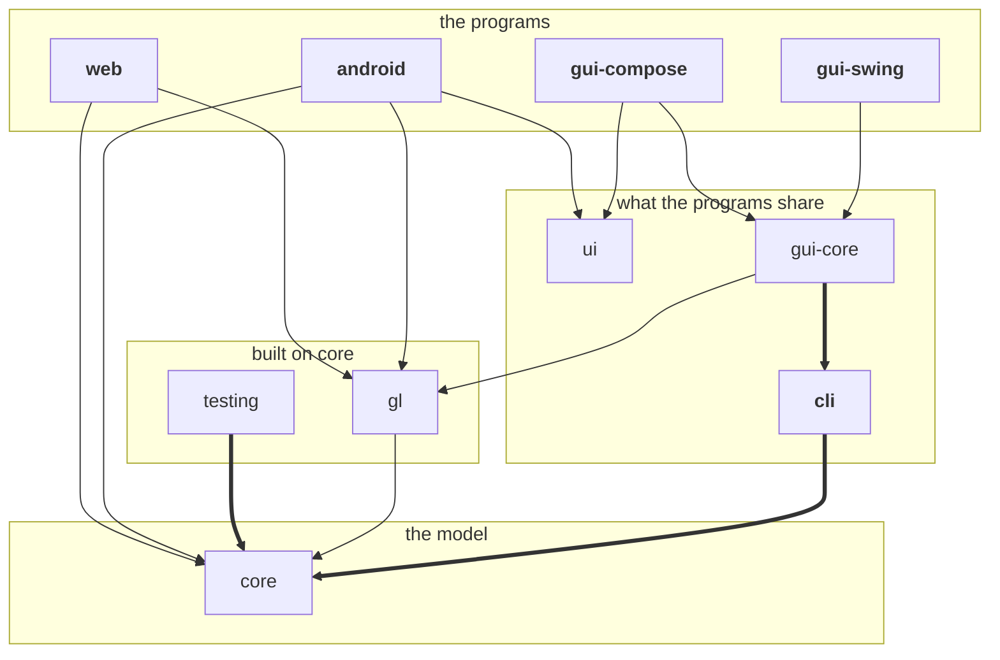
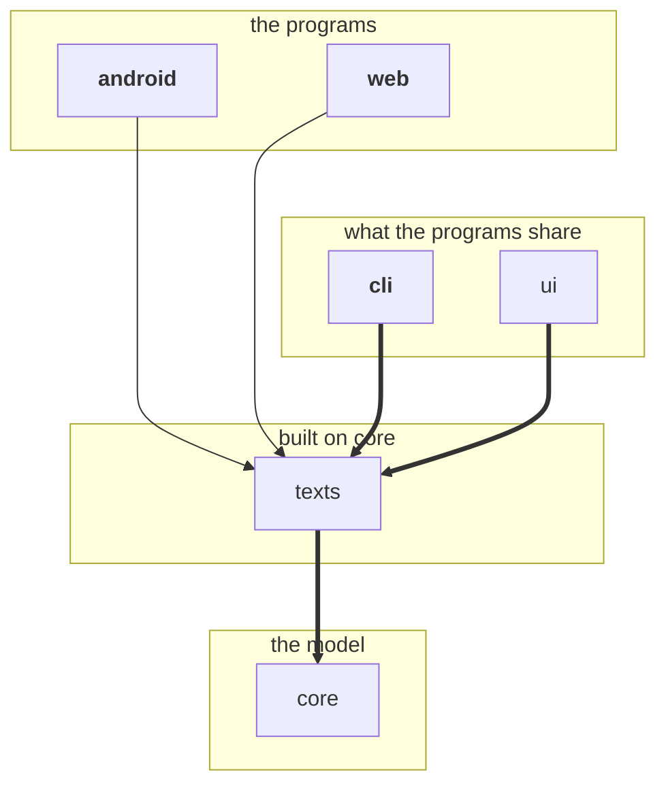
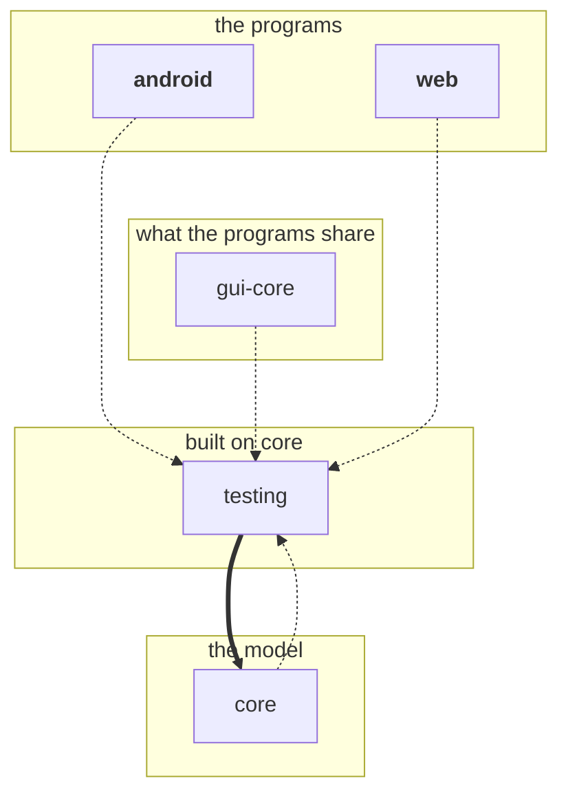
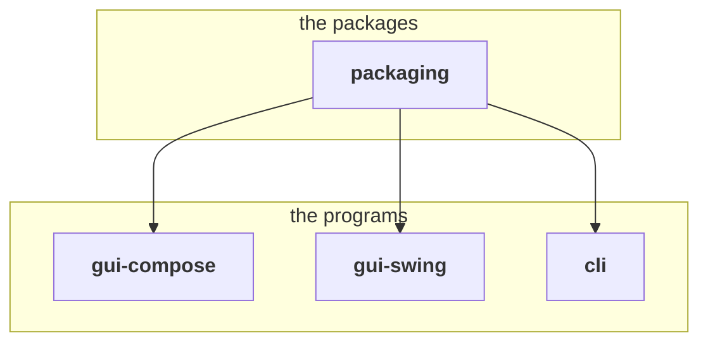

# Developing dog-vision

How the code is laid out, and how a change is checked.
Building the programs is [Building it](building.md)'s.

- [How the code is laid out](#how-the-code-is-laid-out) — the modules, their layers and which uses
  which, and the GPU renderer they share.
- [Checking it](#checking-it) — what each Gradle task tests, the documents held to `core`, the
  Kotlin style, and what GitHub Actions runs.
- The caveats: [the emulator's colours](#caveat-the-emulator-fails-the-video-tests-colour-checks),
  and [Windows without a GPU and
  under Wine](#caveat-windows-is-tested-without-a-gpu-and-under-wine).
- [Where the test data comes from](#where-the-test-data-comes-from) — the test videos and the
  reference values.

## How the code is laid out

| Module                            | Holds                                      | Built for           |
|-----------------------------------|--------------------------------------------|---------------------|
| [`core`](../core)                 | the species, the model, the image pipeline | the JVM, JavaScript |
| [`gl`](../gl)                     | the GLSL ES 3.00 passes that render a view | the JVM, JavaScript |
| [`texts`](../texts)               | the wording, in English and Czech          | the JVM, JavaScript |
| [`ui`](../ui)                     | the controls, in Compose Multiplatform     | Android, the JVM    |
| [`android`](../android)           | the Android app                            | Android             |
| [`web`](../web)                   | the web page                               | JavaScript          |
| [`cli`](../cli)                   | the command line                           | the JVM             |
| [`gui-core`](../gui-core)         | what the desktop windows share             | the JVM             |
| [`gui-compose`](../gui-compose)   | the desktop window, in Compose             | the JVM             |
| [`gui-swing`](../gui-swing)       | the desktop window, in Swing               | the JVM             |
| [`packaging`](../packaging)       | the debs, the rpms, the MSI and the zip    | Linux, Windows      |
| [`testing`](../testing)           | what the renderers' tests hold them to     | the JVM, JavaScript |

[`build-logic`](../build-logic) is no module but a Gradle build of its own, included in this one.
It holds:

- the tasks the Linux packages and the MSI are made with, which a module takes by applying the
  plugin `cz.loplex.dogvision.packaging`;
- [`windowPackages`](../build-logic/src/main/kotlin/cz/loplex/dogvision/packaging/WindowPackages.kt),
  which registers them for a window's deb and rpm, once for both windows;
- [`glNatives` and `windowsRuntime`](../build-logic/src/main/kotlin/cz/loplex/dogvision/packaging/DesktopNatives.kt),
  the natives that `gui-core`'s tests and the windows run with;
- [`artifact()`](../build-logic/src/main/kotlin/cz/loplex/dogvision/packaging/Artifact.kt), which
  marks a task that makes an artifact, for `./gradlew packageAll` to run.

The root project declares the plugin, so these are on every module's build script classpath.

- **`core` has no platform in it**: it holds what the desktop program's `dog_vision.core` holds,
  less video and the window's session.
  The one part written for each platform is how a fact's number is rounded, in
  [`Facts.jvm.kt`](../core/src/jvmMain/kotlin/cz/loplex/dogvision/core/Facts.jvm.kt) and
  [`Facts.js.kt`](../core/src/jsMain/kotlin/cz/loplex/dogvision/core/Facts.js.kt), since JavaScript
  has no `BigDecimal`.
- **`gl`'s passes run on every GPU the programs draw on**: OpenGL ES 3.0 on Android, WebGL 2 in the
  browser, and EGL, ANGLE or WGL on the desktop.
  [`ViewPasses`](../gl/src/commonMain/kotlin/cz/loplex/dogvision/gl/ViewPasses.kt) runs them
  through [`Gl`](../gl/src/commonMain/kotlin/cz/loplex/dogvision/gl/Gl.kt), the part of OpenGL ES
  3.0 they need, which each program implements.
- **`texts`' strings are in [`texts/strings`](../texts/strings)**, in Android's `strings.xml`
  format, which the build compiles into Kotlin, each named by an entry of the enum `Str` or
  `Plural`.
  The app, the web page, the window and the command line all speak through it.
- **`ui`'s Compose Multiplatform 1.12 is Jetpack Compose 1.12**, and its Material 3 1.9 is androidx
  Material 3 1.4, the versions of the app's Compose BOM, so that the app runs one of each.
- **`cli`'s `main` is the window's too**:
  [`runCommandLine`](../cli/src/jvmMain/kotlin/cz/loplex/dogvision/cli/Main.kt) answers `--help` and
  a command line it cannot read itself, converts a photo, and hands anything else to a window given
  to it.
- **`gui-core` has no toolkit in it**, neither Compose nor skiko: the GL contexts, the passes'
  renderer, ffmpeg's feeds, and the pixels read back handed to a function that makes the window's
  image of them.
  Its `LiveSession` holds what a window shows, as the Python program's does, so that the Compose
  window and the Swing one only lay it out.

### Which module uses which

The modules stand in four layers, and a module's code uses only those below it or beside it in its
own.
An arrow points from a module to one it uses:

- **a thick arrow is `api`**: whatever uses the module gets the one it points at too;
- **a thin arrow is `implementation`**: the module keeps the one it points at to itself;
- **a dotted arrow is for tests alone**: the module's tests use it, and its code does not.

A module in bold is a program: its build makes something to run, the app's APK, the web page, or
the packages of the command line and the windows.

What each module uses, less `texts` and the tests:

What uses `texts`:

What uses `testing`, in tests alone:

What the packages take, which `packaging` makes of the windows and the command line:

- **`texts` has a graph of its own, as with it in the first one lines have to cross**, however the
  modules are placed:
  `android`, `web`, and `cli` with `gui-core`, are three that each reach the same three, `core`,
  `gl` and `texts`, and no drawing on a plane joins three to three without a crossing.
  Without `texts` the first graph could be drawn with none, but its layers still cost it one.
- **`cli` is a program, in bold, and stands among what the programs share**, as `gui-core`
  uses it: the window's `main` is `cli`'s.
- **`gui-compose` and `gui-swing` reach `core` and `texts` through `gui-core`**, which passes on
  `cli` and, through it, the two `cli` uses.
- **`ui` passes on `texts`**, as its `text` and `InfoButton` take an entry of `texts`' `Str`.
- **`packaging` has no code of its own**: it takes from the module that has them the JARs a Linux
  package installs, through `jvmRuntimeOf`, as a module takes a library's, and each launcher of a
  package for Windows, its JAR and what it runs on, through the module's `windowsLauncher` task.
- **Only tests use `testing`**, so no program ships it.
  `core`'s tests use `testing`, which in turn uses `core`; Gradle builds `core` itself first, as
  its code does not use `testing`.
- **`./gradlew checkModuleGraph` holds the four graphs together to the modules' build files**, and
  runs in `check`: every arrow declared is drawn in one of them, and none is drawn that is not.

### The view is rendered on the GPU, and a photo at full size on the CPU

- **The view is drawn by `gl`'s shaders**, which apply `core`'s matrix and blur, and decode and
  encode sRGB through `core`'s own lookup tables, so that they agree with it to the rounding of a
  float.
- **In the app, the same passes draw every view there is**: the screen, a recording, which the
  renderer draws into an encoder's surface as well, and a video converted at full size, through the
  Media3 effect [`ViewEffect`](../android/src/main/kotlin/cz/loplex/dogvision/video/ViewEffect.kt).
- **The desktop window renders in a GL context with no window of its own**, and reads the view back
  into the Compose window without waiting for the GPU.
- **A photo saved at full size goes through `core`'s CPU pipeline**, a strip of rows at a time,
  which has no limit on the size of a texture.

## Checking it

`./gradlew check` runs every test task below that needs no phone, Android Lint, the Kotlin style,
the check of [the modules' graphs](#which-module-uses-which), and that of
[the artifacts' folders](building.md#every-artifact-at-once).
The test classes' comments say what each of them holds.

| Task                                           | Tests                                                |
|------------------------------------------------|------------------------------------------------------|
| `./gradlew :core:jvmTest`                      | the model, against the desktop program's values      |
| `./gradlew :core:allTests`                     | the same, and the JVM and Node.js agreeing           |
| `./gradlew :texts:allTests`                    | every language having every string, and plurals      |
| `./gradlew :ui:jvmTest`                        | the shared controls, in Compose's test scene         |
| `./gradlew :cli:jvmTest`                       | the options, EXIF, a conversion, the figures         |
| `./gradlew :gui-core:jvmTest`                  | the window's passes, GL contexts, ffmpeg, session    |
| `./gradlew :gui-swing:jvmTest`                 | the Swing window's image, theme and a dropped file   |
| `./gradlew :web:jsTest`                        | the page's passes, snapshot and recording            |
| `./gradlew :android:connectedDebugAndroidTest` | the renderer, recording and conversion, on a device  |
| `./gradlew :android:lintDebug`                 | Android Lint alone                                   |

- **The renderers' tests hold each GPU renderer to `core`'s CPU pipeline**: the app's, the web
  page's and the window's alike, through [`testing`](../testing)'s reference pattern.
- **`:gui-core:jvmTest` draws on this machine's GPU**, through EGL on Linux and through
  ANGLE and WGL on Windows, and runs the machine's `ffmpeg`.
- **`:web:jsTest` runs in headless Chrome, which renders WebGL 2 in software**, with SwiftShader, as
  [`karma.config.d/webgl.js`](../web/karma.config.d/webgl.js) tells it to.
  `./gradlew :web:jsTest -PwebTestsOnGpu` runs the tests on the GPU instead,
  through ANGLE on Vulkan.
- **`:android:connectedDebugAndroidTest` runs on the connected phone or emulator**, on its GPU and
  codecs.
- **`python3 tools/check_links.py` checks the Markdown**, which `check` does not: every relative
  link resolves, down to its anchor.

### The documents are checked against core

- **`ModelDocTest`, in `:core:jvmTest`, holds [The model](model.md) to `Species`**: both its tables
  list every species, in order, with the peaks, S-cone shares, acuities and sources `core` has,
  formatted as `core` formats them, and the neutral points it quotes still hold.
- **`FiguresTest`, in `:cli:jvmTest`, holds the figures in [`docs/images`](images) to what `core`
  renders**, within 2 in each channel; the captions are left out, as fonts differ between systems.
- **`./gradlew :cli:renderFigures` renders the figures again**, from the apple photo beside them;
  [`Figures.kt`](../cli/src/jvmTest/kotlin/cz/loplex/dogvision/cli/Figures.kt) says what each
  shows.
- **The screenshots are not checked.** `android.png`, `web.png`, `window.png` and
  `window-swing.png` show the programs as they were when taken, with the apple photo open and in
  English: the app on a phone, the page in headless Chrome, and the windows under Xvfb at
  1400 x 820.

### The Kotlin style is ktlint's

The style is [ktlint](https://pinterest.github.io/ktlint/)'s, as IntelliJ IDEA formats Kotlin, set
in [`.editorconfig`](../.editorconfig):

- `./gradlew ktlintCheck` checks it, and `./gradlew ktlintFormat` fixes what it can;
  `build-logic`'s own are `:build-logic:ktlintCheck` and `:build-logic:ktlintFormat`, and each
  module's `check` runs `build-logic`'s;
- `./gradlew checkLineLength` holds every line to 120 characters, comments included: ktlint does not
  measure a line that is a comment and nothing else.

### GitHub Actions runs them on Linux and Windows

[`.github/workflows/ci.yml`](../.github/workflows/ci.yml) runs on every push:

- **On Ubuntu 24.04, `./gradlew check`**, the window's GL tests on Mesa's llvmpipe, as the runner
  has no GPU; then the debs and the rpms of `dog-vision`, `dog-vision-swing` and `dog-vision-cli`,
  each built in two versions and tried by `test_deb.sh --upgrade` in Ubuntu 20.04 and
  `test_rpm.sh --upgrade` in Fedora 42, each window under Xvfb; and each window's tar.gz, unpacked
  on the runner, where its command line runs and its window's main converts a photo.
- **On Windows Server 2022, `./gradlew :gui-core:jvmTest`**, over ANGLE on WARP and over WGL on
  Mesa's llvmpipe, which the job puts beside `java.exe`, as Windows's own OpenGL is 1.1.
- **On Windows Server 2022, the MSI**, built by `package_msi_on_windows.ps1` in two versions and
  tried by `test_msi_on_windows.ps1`; the MSIs are the run's artifacts.
- **On Windows Server 2022, the command line's zip**, built by `package_cli_zip_on_windows.ps1` and
  tried by `test_cli_zip_on_windows.ps1`; the zip is the run's artifact.

[`.github/workflows/msi-under-wine.yml`](../.github/workflows/msi-under-wine.yml) runs when started
by hand, as it installs Wine and makes its prefix each time: the MSI that
`package_msi_on_linux.sh` builds under Wine, in two versions, validated by `smoke.exe` and tried by
`test_msi_on_windows.ps1` on Windows Server 2022, and the command line's zip that
`package_cli_zip_on_linux.sh` builds under Wine, tried by `test_cli_zip_on_windows.ps1` there.

## Caveat: the emulator fails the video tests' colour checks

On the emulator, a BT.709 video comes out as BT.601's matrix decodes it, so a red of 200 comes out
as 186 there, and `VideoFeedTest` and `ConversionTest` fail their colour checks.

- **It goes with the decoder, as far as has been seen, not with the GPU**: the emulator decodes with
  its own `c2.goldfish.h264.decoder`, and on a Redmi Note 13 Pro 5G, Android's software decoder
  `c2.android.avc.decoder` gives the same colours on the phone's Adreno 710.
- **Qualcomm's hardware decoder gives the colours as tagged**, and the tests pass on that phone.
- **The one test that plays a video through the software decoder there checks its size only**: it
  plays a video of 96 x 64, which the hardware decoder refuses.

## Caveat: Windows is tested without a GPU and under Wine

Under Wine 11.18 on Linux, with a Windows JDK 21 and the Windows build of ffmpeg, the Compose
window was tried with a photo, a video, the camera through DirectShow, WGL chosen and WGL taken
where Direct3D 11 is switched off, and the command line.

- **Its tests and its MSI run on GitHub's Windows Server 2022**, as
  [GitHub Actions runs them](#github-actions-runs-them-on-linux-and-windows), which has no GPU:
  ANGLE draws there on Direct3D 11's software rasteriser, WARP, and WGL on Mesa's llvmpipe.
- **ANGLE's Direct3D 11 runs on Wine's translation to OpenGL** under Wine, not on a Windows driver,
  so what Wine shows is the code and ANGLE, not the drivers people have.
- **Wine's own `d3dcompiler_47` never finishes linking one of the passes' shaders**, so ANGLE hangs
  under it; Microsoft's, which `winetricks d3dcompiler_47` installs into a Wine prefix, links it.
- **ANGLE hung there shows nothing and says nothing**: neither a photo nor the camera appears,
  though the camera's light comes on, and as a hang is no failure, the window does not fall back
  to WGL.
- **Which `d3dcompiler_47` a prefix has** shows in its `system32/d3dcompiler_47.dll`, where
  `strings` finds `Wine builtin DLL` in Wine's own.
- **`--gl wgl` draws without Microsoft's `d3dcompiler_47`**, taking WGL alone, as
  [the GPU it draws on](using.md#the-gpu-it-draws-on) says, where installing it is not wanted.
- **Installing the MSI under Wine writes into the home**: Wine turns its shortcuts into the Linux
  desktop's unless `WINEDLLOVERRIDES=winemenubuilder.exe=d` is set, and the prefix's folders link
  into the home unless `winetricks sandbox` removed the links.
- **Removing the MSI under Wine leaves the files in `%ProgramData%\Dog Vision`**: msiexec's log
  shows WiX's RemoveFolderEx finding them under Wine 11.18, and they stay.
- **Under Wine, `ADDLOCAL` installs the Features it names alone**, so a part named without
  `DogVision` comes without the runtime; Windows installs a Feature's parent with it.
- **Under Wine, an upgrade installs every part**, whichever were installed before: Wine's
  `MigrateFeatureStates` migrates nothing, so only Windows shows that a later version keeps them.
- **The Compose window's button that installs ffmpeg is tried on Linux**, with scripts in place of
  winget and PowerShell, as Wine has neither winget nor a registry that winget writes to.
  winget's install itself ran on GitHub's Windows Server 2025, whose image has winget.

## Where the test data comes from

- **[`tools/make_test_videos.sh`](../tools/make_test_videos.sh) writes the videos** in
  [`android/src/androidTest/assets`](../android/src/androidTest/assets) with ffmpeg: four flat quadrants,
  one of them turned as a phone held upright records, and one too small for Qualcomm's hardware
  decoder.
  With the same ffmpeg, it writes the same bytes each time it runs.
- **[`tools/reference_values.py`](../tools/reference_values.py) writes the reference values** in
  [`core/src/jvmTest/resources`](../core/src/jvmTest/resources) from a checkout of the desktop
  program: its matrices, RNL factors and neutral points, images it renders from a test pattern, and
  the facts of every species.
  Its docstring says how to run it; the tests fail when `core` stops matching them.
